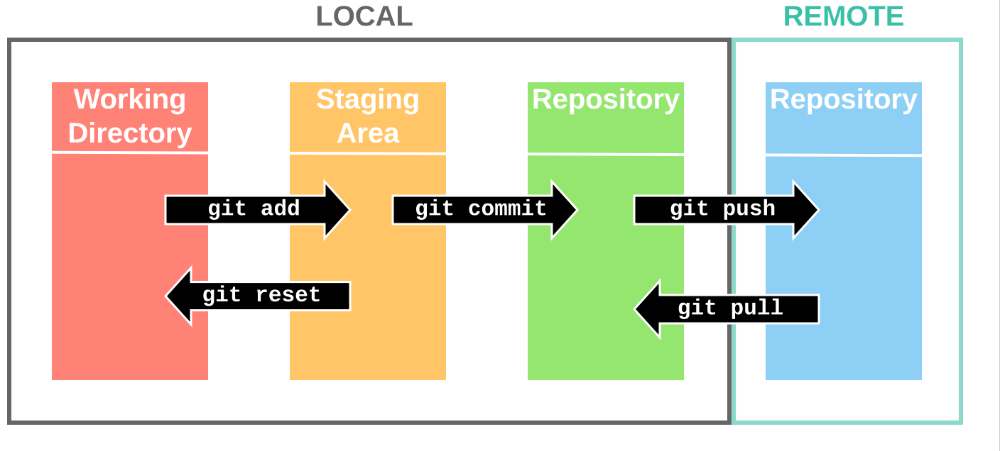
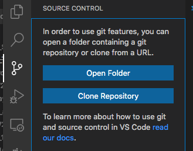
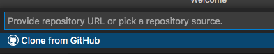
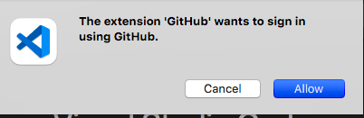
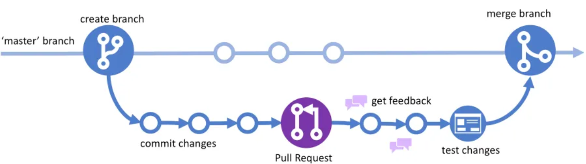

# Introduccion a GIT

---

## Motivación

---

Problemas comunes en el desarrollo de código:
- Terminaré mi parte y luego podrás empezar con tus cambios.
- ¿Puedes enviarme la nueva versión?
- ¿Cuál es la última versión?
- ¿Qué versión estás usando?

---

Un sistema de control de versiones:
- Permite guardar snapshots del proyecto.
- Implementa un modelo de branching (ramas), que permite trabajar a la vez en diferentes características y experimentar sin romper nada.
- Implementa un modelo de merging, para juntar las diferentes versiones de un fichero.
- Funcionalidad de Roll-back: permite volver hacia atrás si nos equivocamos.

---

Branching:
- Muchas veces queremos experimentar una idea o tratar de resolver el problema siguiendo otro enfoque, esto puede terminar en multitud de ficheros.
- Muchas veces terminamos copiando todo el código en otra carpeta.

---

Reproducibility:
- A veces no sabemos qué versión del código nos ha dado los resultados.
- Si encotramos un error no sabemos si afectó a nuestros resultados.

---

¿Por qué Git?
- Fácil de empezar a usar.
- Muy popular.
- Distribuido.
- Muchas plataformas para elegir.
- Github se está convirtiendo en la forma más usada de compartir código.
- Es muy potente pero puede no ser muy "user friendly"

---

## Funcionamiento:

---

## Remoto y local:

---

- Si trabajamos nosotros solos no tenemos por que tener conflictos entre el repositorio local y el remoto. 
- Tenemos que estar seguros de hacer siempre git pull al empezar a desarrollar y git push cuando terminemos; de esta manera nunca perderemos tiempo resolviendo conflictos.

---

- Vscode nos integra un gestor de git muy fácil de usar.
- Existe una extensión llamada Gitlens que añade funcionalidades.

---

## Demo:

1. Crear una cuenta en github: https://github.com/
3. Creamos un repositorio donde pondremos nuestro código.
4. Pulsamos el icono de git en vscode. Nos pedirá autentificarnos en Github.
---

5. Clonamos nuestro repositorio, para ello usaremos vscode.
  - En el menú de git pulsar Clone Repository
  
  - Selecionamos:
  
---
  - Nos pedirá que nos identifiquemos en gihub:
  

---

6. Añadimos código a nuestro repositorio commits.
7. Hacemos push al repositorio remoto.
8. Entramos en la web del repositorio en github y vemos el código.

---

## Ejercicio

- Crea un nuevo repositorio en tu cuenta de github.
- Clona el repositorio en tu ordenador.
- Añade los ficheros del algorimo
- Realiza un commit de tus cambios.
- Realiza un push de tus cambios.
- Ve a GitHub y comprueba que tus cambios están en el repositorio.

---
## Comandos Git:
Todo lo que hacemos con vscode lo podemos hacer con comandos, algunos de los más comunes son los siguientes:

#### Crear y clonar:
|Comando| Descripción |
|--|--|
|git clone repo_url | Copia el repositorio remoto al directorio actual |
|git init | Crea un repositorio vacío en el directorio actual|

---
#### Básicos

|Comando| Descripción |
|--|--|
|git add <file1> <file2> | Añade <file1> y <file2> al staging area.|
|git add *.py | Añade todos los ficheros python al staging area.|
|git status | Lista todos los cambios en el directorio actual.|
|git commit | Graba todos los cambios del staging area al repositorio.|
|git commit -m "Commit message" | Graba todos los cambios del staging area al repositorio con el mensage "Commit message"|
|git commit --amend | Modifica el último commit en vez de crear uno nuevo.|

---

|Comando| Descripción |
|--|--|
|git log <filename> | Imprime la historia de commits de <filename>.|
|git stash | Guarda los cambios locales para poder realizar otras operaciones.|
|git pop | Recupera los cambios guardados en un stash|
|git squash | Junta varios commints en uno solo |

--- 

#### Repositorio remoto:

|Comando| Descripción |
|--|--|
|git fetch | Obtiene el estado de 'origin'. No cambia los ficheros del directorio actual| 
|git fetch <repo> <branch> | Obtiene el estado de <repo> <branch>.|
|pull  	git pull | Incorpora los cambios de 'origin' en el repositorio local. |
|git pull <repo> <branch> | Incorpora los cambios de ' <repo> <branch> en el repositorio local.|

--- 

|Comando| Descripción |
|--|--|
|git push | Incorpora los cambios del repositorio local a 'origin'. |
|git push <repo> <branch> | Incorpora los cambios del repositorio local a <repo> <branch>|
|git rebase | Actualiza la rama a un punto en concreto de otra rama.|
    
- Por defecto fetch, pull y push opera en el repositorio de origen.

---

## Gitkraken

- Gitkraken es una aplicacción que nos permite de manera muy sencilla hacer un seguimineto de los repositorios y realizar acciones sobre ellos.

1. Descargar y instalar gitkraken: https://www.gitkraken.com/ (al realizar la descarga y el registro usa las mismas credenciales que en github)
2. Clona a través de Gitkraken.
3. Realiza un commmit
4. Realiza un push de los cambios.

---
## Colaboración con otros desarrolladores
- Hasta ahora estabamos desarrolando solos, cuando queremos colaborar con otros desarrolladores podemos usar githubflow (https://guides.github.com/introduction/flow/). Es una forma ligera, branch-based workflow usado por equipos de todo el mundo (es usado por los desarrolladores de github por eso el nombre).

---

Tiene 6 pasos:

---

1. Una vez clonado el repositorio en que queremos trabajar, creamos una rama sobre el último commit de la rama master. El desarrollo de cada rama tiene que ser pequeño. Es preferible muchas ramas pequeñas e integrarnos de forma continua.
2. Añadimos commits. Snapshots del desarrollo frecuentes crear puntos a los que podemos volver en caso de errores.
3. Una vez terminado el desarrollo, hacemos un push de nuestra rama y creamos un pull request.
4. Discutir y revisar el código. El equipo realiza la revisión del código comentando, testeando y revisado la pull request.
5. Merge. Una vez pulsado este botón el códígo se junta a la rama master. Siempre realizaremos los merges desde la interfaz web y es recomendable bloquear la rama master para que solo se pueda hacer de esta manera.
6. El código se despliega a los entornos pertinentes.

---

## Ejercicio
En este ejercico vamos a realizar un pull request:
- En tu repositorio crea una nueva rama.
- Añade código.
- Realiza un commit de tus cambios en la rama que has creado.
- Realiza un push al repositorio.
- Crea un pull request en GitHub.
- Finaliza el pull request realizando el merge a la rama main.
- Puedes ver todo el proceso en gitkraken.
