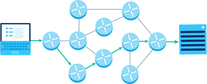

<style>
img[alt~="center"] {
  display: block;
  margin: 0 auto;
}
</style>


# Introducción a redes y protocolos.


---

- Todo el cloud se basa en internet y sus protocolos.
- Es necesario conocerlos minimamente para poder entender que estamos haciendo.
- IP, TCP, HTTP, SSH, etc. ¿?
---


- Internet es una red global de dispositivos de cómputo que se comunican entre sí de alguna manera, ya sea al enviar correos electrónicos, descargar archivos o compartir sitios web.

- Internet es una red abierta: cualquier dispositivo puede conectarse siempre que siga las reglas del juego.
- En redes, las reglas se conocen como protocolos, y definen cómo cada dispositivo debe comunicarse con otros. Internet se construye con muchas capas de protocolos.


---

Necesitamos:
- Conexiones físicas entre dispositivos, junto con protocolos para convertir señales electromagnéticas a datos binarios.
- IP: un protocolo que identifica unívocamente los dispositivos que usan direcciones IP, y provee una estrategia de enrutamiento para enviar datos a una dirección IP de destino.
- TCP/UDP: protocolos que pueden transportar paquetes de datos de un dispositivo a otro, y comprobar si hay errores en el camino. 
- HTTP y DNS: los protocolos que alimentan World Wide Web, que el navegador usa cada vez que carga una página web.

---
# Modelo OSI
- OSI: Open Systems Interconnection.
- Estándar que tiene por objetivo conseguir interconectar sistemas de procedencia distinta para que estos pudieran intercambiar información sin ningún tipo de impedimentos debido a los protocolos con los que estos operaban de forma propia según su fabricante. 

---


---

# Capa Física
- Transformaciones que se le hacen a la secuencia de bits para transmitirlos de un lugar a otro.
- Los bits se manejan como niveles eléctricos
- Protocolos Físicos: Ethernet, Wifi, Bluetooth


---

Por ejemplo los cables ethernet envían datos a través de una red, transmitiendo pulsos de electricidad que representan datos binarios:


---

- Ancho de banda: máxima tasa de bits de un sistema. Si una conexión de red tiene un ancho de banda de 100 Mbps, significa que no puede transferir más de 100 megabits por segundo. 

- Latencia: tiempo entre el envío de un mensaje de datos y la recepción de dicho mensaje, medido en milisegundos.


---

# Capa de enlace de datos:
- Transferencia fiable de información a través de un circuito de transmisión de datos.
- Conseguir que la información fluya, libre de errores, entre dos máquinas que estén conectadas directamente.
- Encapsulan los datos a enviar en paquetes. 

---

# Capa de Red
- Protocolo IP (Internet Protocol).
- Los dispositivos  envían todo tipo de mensajes a otros dispositivos. 
- Un mensaje puede ser un pequeño ping para comprobar si otro dispositivo está en línea, o puede ser una página web completa.
- Existe un límite al tamaño de un mensaje, ya que hay un límite a la cantidad de datos que pueden ser razonablemente transmitidos a la vez por las conexiones físicas de red entre dispositivos.
- Protocolo Internet (IP) describe la estructura de los paquetes
- El actual y más popular protocolo de red es IPv4.
----

- Se usa para toda la comunicación por Internet tanto para manejar direccionamiento como enrutamiento.
- Uso de direcciones IP para identificar de forma única los dispositivos conectados a Internet.

- Puedes pensar que los paquetes IP son como cartas de correo: el encabezado es el sobre con toda la información de enrutamiento que necesita la oficina de correos.

---

- Entrega de los paquetes de datos no confiables. 
- "Mejor esfuerzo": lo hará lo mejor posible, pero garantizando poco.
- Al no garantizar nada sobre la recepción del paquete, este podría llegar dañado, en otro orden con respecto a otros paquetes, duplicado o simplemente no llegar.
- Mediante el protocolo IP y una serie de técnicas se busca la mejor ruta para llegar de una máquina a otra. 

---


---



---

- A menudo hay muchas rutas posibles que un paquete puede seguir para llegar al mismo destino. La disponibilidad de múltiples rutas aumenta la redundancia de una red.
- Internet es un sistema masivo y complejo con millones de componentes que pueden dañarse en cualquier momento y muchos de esos componentes de hecho se dañan.
- https://www.submarinecablemap.com/

---

- Una dirección IP es un número que identifica de manera lógica y jerárquicamente a una interfaz de un dispositivo (habitualmente una computadora), dentro de una red que utilice el protocolo de Internet (Internet Protocol),
- Las cabeceras IP contienen las direcciones de las máquinas de origen y destino (direcciones IP). Direcciones que serán usadas por los enrutadores (routers) para decidir el tramo de red por el que reenviarán los paquetes. 
- Cada paquete IP contiene tanto un encabezado (de 20 o 24 bytes de longitud) como datos (de longitud variable). 
- El encabezado incluye las direcciones IP de la fuente y del destino, además de otros campos que ayudan a enrutar el paquete.
---


---

- Las direcciones IP son jerárquicas:
```79.155.135.7```
- La primera secuencia de bits identifica la red y los bits al final identifican el nodo individual en la red.
- Por ejemplo los dos primeros octetos identifican una red administrada por TelefÓnica ```79.155```. Los dos últimos octetos identifican ese servidor en esa red ```135.7```.
- https://www.cual-es-mi-ip.net/

---

- Comando ```ifconfig``` en linux,  ```ipconfig``` en windows.
- Cada interfaz de red tiene su propia dirección IP.


---

- El protocolo de Internet IP usa este esquema jerárquico de direcciones para facilitar el enrutamiento de mensajes de origen a destino. 
- Una vez que un mensaje llega a la red, un enrutador de red puede encargarse de enviarlo al nodo individual. 
- Subredes: Los administradores de red pueden dividir las direcciones IP en subredes adicionales (subredes) según sea necesario. 
---


---
Hoy en día se usan dos versiones del Protocolo de Internet:
- IPv4, la primera versión utilizada en Internet
- IPv6, un sucesor compatible con las versiones anteriores
- Poco a poco Internet está agotando las direcciones disponibles por lo que IPv6 utiliza direcciones de fuente y destino de 128 bits, muchas más direcciones que las que provee IPv4 con 32 bits.


---

# IP Pública y Privada

- Existen un grupo de ips que se usan dentro de las redes locales.


| From | To | Prefix|
|--|--|--|
|10.0.0.0  |10.255.255.255 | 10/8 |
|172.16.0.0  |  172.31.255.255  | 172.16/12 |
|192.168.0.0  | 192.168.255.255 | 192.168/16 |


---


---


---


---

- La dirección puede cambiar al reconectar. A la posibilidad de cambio de dirección de la IP se denomina dirección IP dinámica.
- Los sitios de Internet que por su naturaleza necesitan estar permanentemente conectados, generalmente tienen una dirección IP fija (IP fija o IP estática); es decir, no cambia con el tiempo.

---

# Capa de transporte:

- El Protocolo Internet (IP) describe cómo dividir mensajes en múltiples paquetes IP y enrutar dichos paquetes a su destino saltando de enrutador a enrutador.
- Sin embargo, IP no maneja todas las eventualidades que pueden ocurrir con paquetes.

---

- Un dispositivo puede enviar múltiples mensajes a un destino, y este necesita identificar qué paquetes pertenecen a cuál mensaje.
- Los paquetes pueden llegar fuera de órden. Esto puede suceder especialmente si dos paquetes siguen caminos diferentes hacia su destino.
- Los paquetes pueden llegar corruptos, o sea que por alguna razón, los datos recibidos ya no coinciden con los datos enviados originalmente.
- Los paquetes pueden perderse debido a problemas en la capa física o en las tablas de reenvío de los enrutadores.

---

- Los protocolos de transporte son los encargados de la transferencia libre de errores de los datos entre el emisor y el receptor
- Protocolos de transporte:
    - UDP (User Datagram Protocol): no orientado a la conexión, Útil para audio, video etc. Más rápido.
    - TCP (Transmission Control Protocol): se diseñó específicamente para proporcionar un flujo de bytes confiable de extremo a extremo a través de una interred no confiable.

---
## Puertos
- Los protocolos de transporte se ocupan de la administración de los puetos.
- Un dispositivo en red puede recibir mensajes en diferentes puertos virtuales, similar a cómo un puerto marítimo puede recibir barcos en diferentes muelles. Los diferentes puertos virtuales ayudan a distinguir diferentes tipos de tráfico de red. 
- Esta asignación de puertos permite a una máquina establecer simultáneamente diversas conexiones con máquinas distintas, ya que todos los segmentos que se reciben tienen la misma dirección, pero van dirigidos a puertos diferentes. 
- https://en.wikipedia.org/wiki/List_of_TCP_and_UDP_port_numbers

---

## Capa de transporte: UDP
- El Protocolo de datagrama de usuario (UDP) es un protocolo ligero de transporte de datos que funciona sobre IP. 
- UDP proporciona un mecanismo para detectar datos corruptos en paquetes, pero no intenta resolver otros problemas.
- UDP es conocido como el protocolo de datos no confiable.

---


---

En la cabezera UDP tenemos:
- Los primeros cuatro bytes del encabezado UDP almacenan los números de puerto para el origen y el destino. 
- Los siguientes dos bytes del encabezado de UDP almacenan la longitud (en bytes) del segmento (incluyendo el encabezado). 
- Los dos últimos bytes del encabezado de UDP son la suma de control, un campo usado por el remitente y el receptor para detectar corrupción de datos. 

---
## Capa de transporte: TCP
- El Protocolo TCP es un protocolo de transporte que se usa sobre IP para asegurar transmisión confiable de paquetes. 
- TCP incluye mecanismos para resolver muchos de los problemas que surgen en la mensajería basada en paquetes, tales como paquetes perdidos, paquetes fuera de orden, paquetes duplicados y paquetes corruptos.
- Dado que TCP es el protocolo usado más comúnmente sobre IP, la pila del protocolo de Internet a veces se denomina TCP/IP. 

---


---

- Cuando dos computadoras quieren enviar datos entre sí a través de TCP, necesitan establecer primero una conexión 


---

- Cuando un paquete de datos se envía sobre TCP, el destinatario siempre debe confirmar su recepción.


- La primera computadora envía un paquete con datos y un número de secuencia. La segunda computadora confirma con el bit ACK encendido e incrementa el número de confirmación con la longitud de los datos recibidos.

---
- Los números de secuencia y de confirmación son parte del encabezado de TCP:


---
- Cualquiera de las dos computadoras puede cerrar la conexión cuando ya no quiere enviar o recibir más datos.


---
- Las conexiones TCP pueden detectar paquetes perdidos usando un tiempo de espera.


---
- Las conexiones TCP pueden detectar paquetes fuera de orden usando los números de secuencia y de confirmación.


---
- El paquete faltante puede ser por ejemplo uno perdido y el remitente debe retransmitir el paquete.


---
# Capa de Aplicación
- Define los protocolos que utilizan las aplicaciones para intercambiar datos.
- Estos protocolos se costruyen sobre TCP/IP.
    - HTTP
    - SSH
    - Protocolos para el envío de correo electrónico (SMTP, POP, IMAP) 
    - Intercambio de archivos (FTP).
- Cada uno de ellos suele usar un determinado puerto.
---
# HTTP
- Los servidores web utilizan el protocolo Hypertext Transfer Protocol (HTTP) para solicitar el contenido de la página web en esa dirección IP.
- HTTP es el leNguaje común de internet.
- Los componentes básicos de la World Wide Web son clientes y servidores HTTP.
- HTTP usa el protocolo TCP para transportar sus mensajes.
- TCP usa IP para las conexiones, direciones IP y Puertos.


---

URIs

- Cada servidor tiene un nombre, de manera que los clientes puedan llamarlo.
- El nombre del servidor se denomina Uniform Resource Identifier o URI.
- Son como direcciones postales de cada servidor.

URLs
- Uniform Resource Locator (URL) es el URI más común.
- Especifica la localización específica de un recurso en un servidor en concreto.
- Tiene 3 partes:
    - Esquema: Describe el protocolo usado para comunicarse con el recurso, normalmente el protocolo HTTP (http:// ).
    - Dirección
    - Localización: Donde esta el recurso localizado en el servidor.

---

- Una trasación HTTP consiste en un comando de request (del cliente al servidor) y una respuesta (del servidor al cliente). 
- Esta comunicación ocurre en bloques formateados llamados mensajes HTTP.
- HTTP soporta distintos comandos, llamados  HTTP methods o verbos.
- Cualquier comunicación HTTP tiene asociada un verbo.
- El método dice al servidor que acción tiene que realizar.

---

- Algunos de estos verbos son: GET, POST, DELETE, PUT etc


---

- Todas las respuestas HTTP tienen un codigo de status.
- El código en un numero de 3 dígitos que dice al cliente si la petición ha sido procesada correctamente o si se requieren otras acciones.

|Code| Descripción|
|---|---|
|200| OK|
|404| Not Found|
|500| Server Internal Error|	
---

Los pasos que realizamos para mantener una comunicación HTTP son los siguientes:

- Paso 1: El usuario escribe una URL en el navegador:


- Para el ejemplo usaremos: http://www.example.com/index.html
- Empieza con "http". Es una señal al navegador que necesita usar HTTP para obtener el documento en ese URL.

---

Paso 2: el navegador busca la IP
- URLs amigables para humanos en los navegadores, como "google.com". Esos nombres de dominio se mapean a direcciones IP. Esto lo maneja el Sistema de nombres de dominio o Domain Name System DNS


---

- Paso 3: el navegador envía una solicitud HTTP
Una vez que el navegador identifica la dirección IP de la computadora que aloja la URL solicitada, envía una solicitud HTTP.


---

- Una solicitud HTTP puede ser tan corta como dos líneas de texto:

```
GET /index.html HTTP/1.1
Host: www.example.com
```

- La primera palabra es el verbo HTTP: "GET". Hay otros verbos para otras acciones en web, como enviar datos de un formulario ("POST").
- La siguiente parte especifica la ruta: "/index.html". La computadora que hospeda el sitio web almacena todo su contenido, así que el navegador debe especificar qué página cargar, y en este caso se indica la página principal del sitio.
- La parte final de la primera línea especifica el protocolo y la versión del protocolo: "HTTP/1.1".
- La segunda línea especifica el dominio del URL solicitada. Esto es necesario en caso que el servidor hospedero o anfitrión almacene el contenido de varios sitios web.

---

Paso 4: el servidor envía de vuelta la respuesta HTTP
- Una vez que la computadora anfitrión recibe la petición HTTP, devuelve una respuesta tanto con el contenido como con los metadatos asociados.


---

- La respuesta HTTP empieza de forma similar a la solicitud:

```
HTTP/1.1 200 OK
```

- La respuesta empieza con el protocolo y la versión, "HTTP/1.1".
- El siguiente es el código de estado HTTP; y en este caso, es 200. Ese código representa una recuperación exitosa del documento ("OK").
- Si el servidor no hubiera podido recuperar el documento, los códigos de estado darían más información.

---

- La siguiente parte de una respuesta HTTP son los encabezados. Le dan al navegador detalles adicionales y lo ayudan a mostrar el contenido.
- Estos dos encabezados son comunes en la mayoría de las solicitudes:

```
Content-Type: text/html; charset=UTF-8
Content-Length: 208
```

---

- El tipo de contenido (Content-type) le dice al navegador qué tipo de documento se envía:
    - "text/html": archivos de texto HTML.
    - "image/png": imágenes.
    - "video/mpeg": vídeos.
    - "application/javascript": script.
    - "application/javascript": json.

- Content-length indica la longitud del documento en bytes, lo que ayuda al navegador a saber cuánto tardará un archivo en descargarse.
- Finalmente, la respuesta HTTP escribe el documento solicitado.
---

Paso 5: el navegador muestra la respuesta


---


---


- Una página web consiste en múltiples HTTP transactions para mostrarse.


---

- Muchos navegadores incluyen herramientas de depuración, que permiten ver las peticiones HTTP y sus respuestas mientras se navega la web.
- Podemos probar:
    - Necesitamos abrir las herramientas de desarrollo de Chrome. Una forma de hacerlo es en el menú "Ver", luego seleccionar "Desarrollador" → "Herramientas de desarrollador". Una vez que se abra esa opción, selecciona la pestaña "Red" (o "Network").
    - Luego, escribe una URL en la barra del navegador, como "http://www.example.com/index.html". Una solicitud HTTP aparece en la consola y el navegador muestra la página.
    - Podemos ver detalleas de la solicitud: Haz clic en "index.html" bajo la columna "Nombre". Una interfaz con pestañas aparece y por omisión una pestaña "Encabezados" (o "Headers"). 

---

# HTTP y TCP/IP

- HTTP es un protocolo que se construye encima de los protocolos TCP/IP.
- Cada solicitud HTTP está dentro de un paquete IP, y cada respuesta HTTP está dentro de otro paquete IP, o más típicamente, múltiples paquetes, ya que los datos de respuesta pueden ser muy grandes.


---

# Otras aplicaciones:

- Caches: guardan copias de contenido popular más cerca de los clientes.
- Proxies: Itermediarios entre el cliente y el servidor

- Gateways: Servidores especiales que actuan de intermediarios de otros servidores (por ejemplo para convertir trafico a otros protocolos)

