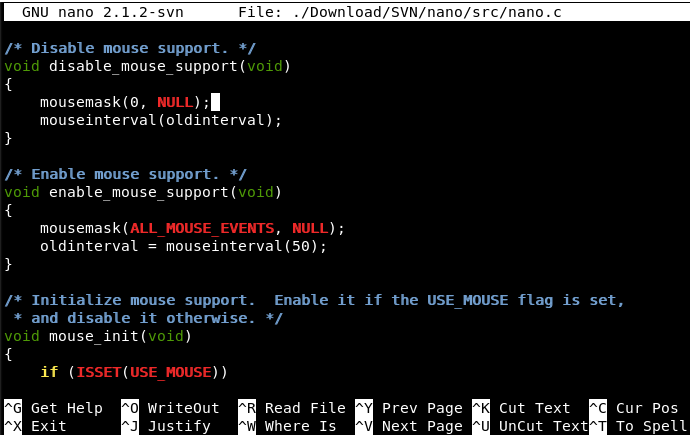

<style>
img[alt~="center"] {
  display: block;
  margin: 0 auto;
}
</style>

# Introducción a la terminal de comandos

---

# Introducción a la terminal de comandos

- La línea de comandos puede facilitarnos mucho el desarrollo.
- Es muy común su uso en las plataformas cloud (virtual machines).
- Se pueden hacer tareas muy complejas en ella.

---

## ¿Qué es la línea de comandos?

- Es un programa que interpreta comandos.
- Permite al usuario ejecutar comandos introducidos de manera manual o de forma automática en scripts.
- No es un sistema operativo es una forma de interactuar con él como lo hace la interfaz gráfica.

---

#### ¿Qué es BASH?
- BASH = Bourne Again SHell
- Un remplazo de la original BourneShell(/bin/sh) escrita por Steve Bourne para los sistemas UNIX.
- Añade funcionalidad y es más facil de usar
- Terminal por defecto en la mayoría de los sistemas Linux.
- La terminal la tenemos instalada por defecto en MacOS y Linux.

---
### Windows
- La terminal de windows no es una termial BASH.
- Podemos instalar una terminal bash.
- https://git-scm.com/downloads
- Abrir el programa Git Bash.
- Podemos poner esta terminal por defecto en vscode:


---

## Ejecutando comandos:    

###  Sintaxis

Los comandos se pueden ejecutar solos o pasando argumentos adicionales:

```bash
command [-argument] [-argument] [--argument] [file]
```

---

Ejemplos: 

| Comando | Descripción |
|--|--|
|ls|Lista de ficheros en el directorio actual|
|ls -l|Lista de ficheros en el directorio actual en formato extendido|
|ls -l --color| Lista de ficheros en el directorio actual en formato extendido con color|
|cat filename|Muestra los contenidos del fichero filename|
|cat -n filename|Muestra los contenidos del fichero filename con números de línea|

---

### El PATH:
- La mayoría de los programas están el PATH predeterminado y se pueden ejecutar directamente: escribir el comando **ls** ejecuta el comando ls.
- Los comandos disponibles son los programas que están en los directorios almacenandos en la variable PATH.
- Para ejecutar programas en el directorio actual: 
    ```bash 
    ./program
    ```
- Para ejecutar programas en otro directorio 
     ```bash 
    ~/bin/program
    ```
---

### Ayuda

- La mayoría de los comandos tienen una opción --help o -h, que permite obtener una ayuda simple. Ejemplo: grep --help
- La mejor fuente de ayuda es usar el comando man: man ls 
- Para salir pulsar Q.

---

### Atajos
Algunos shortcuts para mejorar el manejo de la terminal:

|Comando |Explanation|
|--|--|
|Up/Down Arrow Keys|Hace scroll por los comandos ejecutados anteriormente|
|history|Muestra la historia de todos los comandos introducidos|
|TAB Completion|Autocompletado|
|[Ctrl]+c |Termina el proceso actual. Si no está corriendo de fondo.|
|[Ctrl]+d |Termina la terminal actual.|

---

### Caracteres Especiales
- Antes de ver los comandos básicos, vamos a ver los caracteres y símbolos resevados por la terminal.

| Comando | Descripción |
|--|--|
| / | Separador de directorios|
| . | Directorio actual|
| ..| Directorio padre o anterior|
| ~ | Directorio del home del usuario actual|
| * | Representa 0 o más caracteres en un nombre de fichero. Por ejemplo pic*2002 representa pic2002, picJanuary2002, picFeb292002, etc.|

---

| Comando | Descripción|
|--|--|
| ? | Representa un único caracter en un nombre de fichero. hello?.txt puede representar hello1.txt, helloz.txt, pero no hello22.txt|
| [] | Representa un rango de valores. [0-9], [A-Z], etc. Ejemplo: hello[0-2].txt representa hello0.txt, hello1.txt, and hello2.txt|
| ; |  Permite la ejecución de varios comandos en una sola línea|
| && |  Permite la ejecución de varios comandos en una sola línea, pero solo ejecuta el sigueinte si el anterior ha finalizado sin errores |
| & | Ejecuta un comando en background. Ejemplo: find / -name core > /tmp/corefiles.txt & |

---

## Navegando por el Sistema de Ficheros
- No hace muchos años el acceso a nuestros ficheros se hacía tecleando una infinidad de instrucciones en nuestro terminal.
- La consola puede seguir siendo muy necesaria en ocasiones. 
- Así es bueno conocer los comandos que nos permitirán movernos de un directorio a otro sin problemas.
- El sistema de ficheros de Linux tiene una estructura jerárquica de directorios y ficheros.
- La base del sistema de ficheros es el directorio  “/”. Al contrario de Windows donde tenemos una base para cada disco duro, en Linux tenemos solo un inicio.

---
- Algunos comandos:

| Comando | Descripción|
|--|--|
|cd /home/usuario| Lleva directamente hasta la ruta que indiques, en este caso hasta el directorio “usuario”.|
|cd ..|Retrocede un nivel en la jerarquía de directorios.|
|cd ../..| Retrocede 2 niveles en la jerarquía de directorios.|
|cd| Lleva al directorio raíz de esa unidad.|
|cd ~usuario| Lleva al directorio principal del usuario que indiques.|
|cd –| Retrocede al directorio anterior.|

---

| Comando | Descripción|
|--|--|
|pwd| Muestra la ruta del directorio donde te encuentras actualmente.|
|ls| Muestra los archivos y carpetas del directorio donde te encuentras.|
|ls -l| Muestra los detalles de archivos y carpetas del directorio actual.|
|ls -a| Muestra los archivos ocultos del directorio actual.|

---

## Trabajando con ficheros y directorios
- Se pueden hacer muchas cosas como por ejemplo crear, copiar, mover o borrar archivos y carpetas desde el terminal de Linux. Para ello solo necesitarás utilizar una serie de comandos básicos para Linux con los que podrás gestionar tus archivos.

---
| Comando | Descripción |
|--|--|
| mkdir Directorio| Crea una nueva carpeta o directorio con nombre que le indiques. En este caso, “Directorio”.|
| mkdir Directorio1 Directorio 2| Crea dos carpetas simultáneamente.|
| rmdir Directorio| Borra la carpeta llamada “Directorio”.|
| rm -rf Directorio| Elimina una carpeta llamada “Directorio” y todo su contenido.|
| mv Viejodirectorio Nuevodirectorio| Renombra o mueve un archivo o carpeta.|

---

| Comando | Descripción  |
|--|--|
| cp Archivo| Copia un archivo.|
| cp Archivo1 Archivo2| Copia dos archivos simultáneamente.|
| cp -a Directorio| Copia una carpeta completa, en este caso “Directorio”.|
| cp -a Directorio1 Directorio2| Copia dos directorios simultáneamente.|

---

| Comando | Descripción  |
|--|--|
| ln Archivo Enlacearchivo| Crea un enlace físico con el nombre indicado al archivo o directorio indicado.|
| touch fichero | Crea un fichero de nombre fichero|
|cat | Muestra un fichero por pantalla|
|head |Muestra las primeras líneas de un fichero|
|tail |Muestra las últimas líneas de un fichero|

---

## Comandos para información del sistema:
- En GNU/Linux es posible conocer la configuración de nuestro sistema, versión y sus componentes de hardware usando la terminal. No es necesario instalar otros programas. 

---

| Comando | Descripción  |
|--|--|
|top|Muestra las tareas.
|arch|Muestra la arquitectura de tu ordenador.
|ps|Muestra los processos que se están ejecutando actualmente.|
|date| Mostrará la fecha actual del sistema.|
|df| Muestra el espacio libre en disco (“Disk Free”)|
|du| Muestra el uso de disco de un directorio. “du -s” para el directorio actual.|
|free| Muestra la memoria usada y disponible|

---

- Un buen programa que resume todo la anterior es htop. Lo podéis instalar como veréis más adelante.

---


## Búsqueda
- Podemos buscar entre nuestros archivos en el sistema.
- Solo tendrás que usar estos comandos para buscarlos por formato de archivo, por nombre, etc.

---

| Comando | Descripción  |
|--|--|
|find . -name Archivo| Busca ese archivo o directorio comenzado por el directorio actual|
|find / -name Archivo| Busca ese archivo o directorio comenzado por la raíz del sistema|
|find / -user Usuario| Busca archivos y directorios propiedad del usuario “Usuario”|

---

| Comando | Descripción  |
|--|--|
|find /home/usuario -name \*.bin| Busca todos los archivos con la extensión que le indiques, en este caso “. bin”, dentro del directorio indicado, que en el ejemplo es “/home/usuario”|
|find /usr/bin -type f -mtime -5| Busca los archivos creados o cambiados en el sistema dentro de los últimos “5” días|
|Whereis python| Muestra la ubicación de un archivo binario, de ayuda o fuente. En este caso pregunta dónde está “python”|
|Which python| Muestra la ruta completa al binario/ejecutable que le indiques|

---


Ejemplo:
```bash
find . -name \*.py 
```

Busca todos los ficheros en el directorio actual y subdirectorios de este, que terminen con .py al final de sus nombres.

---

## Comandos para la gestión de grupos, usuarios y permisos

- Todo sistema operativo tiene un apartado de su configuración destinado a la gestión de usuarios, grupos y permisos. 
- Los usuarios de escritorio en cambio no necesitan grandes despliegues, pero en ocasiones pueden surgir conflictos con los permisos de archivo. Por ejemplo puede suceder que no puedas editar o borrar un archivo de tu ordenador o que no puedas usar según qué periférico porque no estás en el grupo adecuado.
- Para gestionar los atributos y permisos de los archivos en Linux, solo tendrás que escribir el comando adecuado para conseguirlo. Estos son algunos de los más habituales:

---

| Comando | Descripción  |
|--|--|
|ls -lh| Muestra los permisos de un archivo.|
| chown Usuario1 Archivo1|Cambia el propietario de un determinado archivo.|
| chown +x fichero|Da permisos de ejecución a un determinado archivo.|
| chown -R Usuario1 directory1| Cambia el propietario de un determinado directorio y de todos los archivos y subdirectorios contenidos dentro.|

---


# Otros Comandos

|Comando | Explicación |
|--|--|
|clear|Limpia la pantalla|
|echo| Muestra contenido por pantalla. Es como el print() por ejemplo echo “Hello World”
|more |Muestra un fichero una página cada vez.|

---

|Comando | Explicación |
|--|--|
|less|Una mejora del comando “more”. Permite hacer scroll|
|grep|Permite buscar en el contenido de un fichero. Por ejemplo: grep “abuscar” fichero 
|history| Muestra los últimos comandos introducidos |
|history 10| Muestra los últimos 10 comandos introducidos|

---
# Comando sudo
La palabra sudo antes de cualquier comando ejecuta el comando con permisos de administrador.
```bash
sudo command
```

---

# Otros Comandos: ping y traceroute
- El comando ping nos permite comprobar si somos capaces de llegar a una derminada dirección IP (0.0.0.0 es una dirección que apunta a la propia máquina):
```bash
ping 0.0.0.0
```
- El comando traceroute nos permite ver los saltos que damos desde nuestra máquina a otrae.
```bash
traceroute google.com
```

---

# Otros Comandos: wget
- El comando wget nos permite realizar peticiones http a una dirección.

```bash
wget -O- elpais.es
```

```bash
wget -q -O- google.com
```
- ```-q``` para que no salgan logs.
- ``` -O- ``` para que la salida salga por pantalla.

---

# Otros Comandos: zip

- El comando ```zip``` nos permite crear ficheros zip.
- Para añadir un fichero:

```bash
zip file.zip file_to_add.txt 
```

- Para añadir un directorio:
```bash
zip -r file.zip folder_to_add
```

- Para añadir el directorio actual:
```bash 
zip -r file.zip .
```

- ```-g``` para seguir añadiendo ficheros al zip (grow):
```bash
zip -g file.zip file_to_add.txt 
```

---

# Piping y Re-Direction
- Nos sirve para combinar comandos y guardar la salida de estos.

---

## Piping 

- El caracter  “|”, se usa para encadenar la salidad de un commando al siguiente.
- Por ejemplo:
    ```bash
    ls -la /usr/bin | less
    ```
- Se ejecuta el comando “ls -la /usr/bin”, el cual da una lista muy larga de ficheros. Posteriormente se encamina la salida al comando less que muestra una pantalla cada vez.

---


## Redirecting
- Muchas veces queremos guardar la salida de un comando. Para ello usamos el caracter  “>”.
- Ejemplo: ```ls -la . > data.txt```: guarda la salida al fichero data.txt  si el fichero existe lo sobreescribe.
- Ejemplo: ```ls -la . >> data.txt```: guarda la salida al fichero data.txt concatenando al final de los contenidos existentes.

---

## Scripts
- Un conjunto de comandos se pueden agrupar en ficheros formando un script.
- Guardamos el fichero como .sh
- Le damos permisos de ejecución: chmod +x script.sh
- Ejecutamos con: ./script.sh
---

Ejemplo:

```bash
#!/bin/bash

echo -e "Please enter your name: "
read name
echo "Nice to meet you $name"
```

---

## Instalar utilidades en la terminal

- Instalar aplicaciones por aplicaciones por terminal es la opción más rápida cuando tenemos por ejemplo una máquina virtual. 
- Por desgracia instalar paquetes no es del mismo modo según al distribución que usemos. En este punto debemos diferenciar los comandos en función del sistema o gestor de paquetes que utilice tu distro Linux: RPM, DEB o YUM. Por ejemplo Amazon Linux usa YUM y Ubuntu usa DEB.

---

|Comando | Descripción|
|--|--|
|yum install paquete | Instala o actualiza un determinado paquete.|
|yum update| Instala o actualiza la lista de paquetes instalados.|
|yum upgrade| Instala o actualiza todos los paquetes instalados.|
|yum remove paquete| Elimina el paquete deb indicado del sistema.|
|yum check| Verifica la correcta resolución de las dependencias.|
|yum clean| Limpia la cache desde los paquetes descargados.|

---

Ejemplo  ``yum install nano`` o ``yum install htop``

Nota: Suele ser necesario tener permisos de administración para poder instalar paquetes, para ejecutar un comando con estos permisos ponemos sudo delante:
Ejemplo  ``sudo yum install nano``.

---

- Si instalamos htop con ``yum install htop``
- Tenemos disponible el comando htop que nos da información ampliada de los recursos de la máquina:


---


## Editor nano.
Existen múltiples editores de texto que podemos usar dentro de la terminal, uno de los más sencillos y que suele estar instalado por defecto en muchos sitemas Linux es nano:




Aquí puedes encontrar un resumen de sus comandos más comúnes: https://www.nano-editor.org/dist/latest/cheatsheet.html

---

## Configuracion de la Terminal

- Existe un fichero en el raíz del usuario llamado ```.bashrc``` donde podemos configurar comandos y aspecto de la terminal.
- Todos los comandos que se ponen estos ficheros se ejecutan antes de mostrarse la terminal.

---

# Ejercicio
- Crea un fichero nuevo (tip: comando touch, nombre fichero).
- Crea una carpeta nueva.
- Mueve el fichero a la carpeta recién creada.
- Crea un fichero .py.
- Edita el fichero para que muestre tu nombre por pantalla, para ello usa nano.
- Ejecuta el programa.
- Elimina todo lo creado.

---

# Ejercicio
- Crea dos ficheros de texto.
- Comprime los dos ficheros en un zip.
- Mueve el fichero zip a otro directorio.
- Descomprime el contenido del fichero zip.

