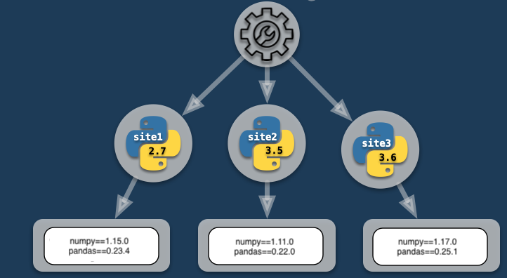
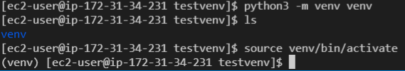
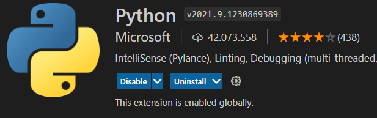
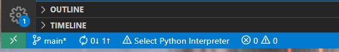
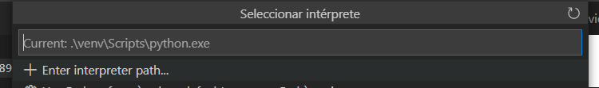
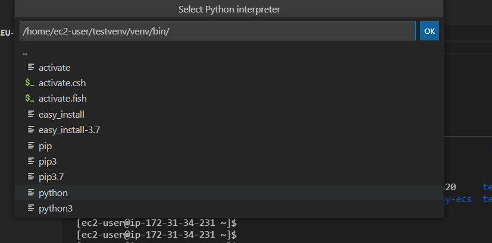

<style>
img[alt~="center"] {
  display: block;
  margin: 0 auto;
}
</style>

# Instalación de librerías con virtual enviroments

---

## Requirements file
- Los proyectos de python siempre van acompañados de un fichero que indica las librerías que se usan. 
Este fichero se denomina requirements.txt y dentro tiene la siguiente estructura:
```
jupyterlab==0.35.4
numpy==1.16.3
pandas==0.24.2
```

---

- Ver todas las librerías instaladas:
```bash
pip freeze
```
- Guardar las instaladas en un fichero:
```bash
pip freeze > requirements.txt
```

- Para instalar todas las requeridas para el proyecto:
```bash
pip install -r requirements.txt
```

---

## Virtual enviroment

- En muchas ocasiones las librerías de un proyecto a otro pueden variar (distintos requeriments.txt), por lo que es necesario instalar de manera aislada estas para que no creen conflictos.


---

- Solución virtual enviroments.



- Es recomendable siempre usar virtual enviromentos o contendores docker.
- Para algunos servicos de AWS son usados extensamente.

---

Para crear un virtual enviroment hacemos lo siguiente:
1. Abrir una terminal
2. Creación del virtual enviroment:
```
python3 -m venv venv
```
en windows con anaconda:
```
py -m venv venv
```

- Se crea una carpeta con el nombre venv en el directorio donde nos encontremos.
- El segundo venv es el nombre de la carpeta donde se van a guardar las librerías.
- Podemos ponerle otro nombre:
```
python3 -m venv mivenv
```

---
2. Activar el virtual enviroment:
```
source venv/bin/activate
```
en windows con anaconda:
```
source venv/Scripts/activate
```
Este paso no es necesario si configuramos correctamente vscode.

3. Aparecerá: (tutorial-env) a la izquierda. Esto nos indica que tenemos ese virtual enviroment activado.
4. Instalar las librerías necesarias en el virtual enviroment
5. Podemos ejecutar programas python.



---
## Virtual enviroment: vscode
- Instalamos la extensión de python en vscode:


- Selecionamos el interprete (para axtivar la extensión abrir un fichero de python):



---

- En path seleccionamos:

- Ahora vscode dispondrá de autocompletado y la ejecución debuger y terminal funcionarán por defecto en ese virtual enviroment.

---
## Virtual enviroment: Windows
- Si quereis usarlo en windows es necesario cambiar algunos comandos.
- En Windows, ejecuta uno de los siguientes comandos (depende de la versión):
```
venv\Scripts\activate.bat
```
```
& venv/Scripts/activate.ps1
```

---
- Si en Windows extieran problemas de permisos ejecutar en una terminal con permisos de administración los siguientes comandos:
```
get-ExecutionPolicy
```
```
Set-ExecutionPolicy Unrestricted
```

---

## GIT
- Si no tenemos cuidado podemos acabar introduciendo todo el código de todas las librerías que usamos en nuestro repositorio de git.
- Para ello tenemos el fichero ```.gitignore``` en el raiz del repositorio donde podemos.
- En este fichero decimos los directorios y  ficheros que no queremos sincronizar.
- Normalmente solemos poner en un proyecto python:
```
.ipynb_checkpoints
__pycache__
/venv
.vscode
```

---
## Ejercicio

- Crea un repositorio nuevo en github.
- Desde el vscode de tu máquina clona el repo.
- Abre el repo en vscode (file -> open folder)
- Crea un nuevo virtual enviroment.
- Configura la extensión de python.
- Crea un fichero de python y ejecutalo desde la terminal y pulsando el botón de play.
- Instala pandas.
- Explora la carpeta del virtual enviroment. ¿Qué encuetras?
- Crea un fichero ```requeriments.txt``` con las librerías que tienes instaladas.
- Haz un commit y un push con los cambios (ten en cuenta lo dicho sobre git).
