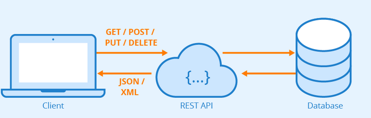
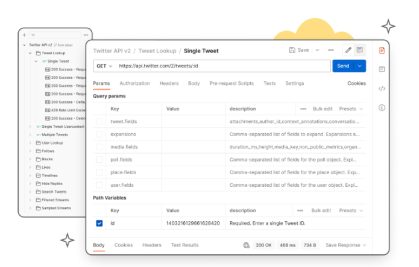

<style>
img[alt~="center"] {
  display: block;
  margin: 0 auto;
}
</style>


# Introducción a las API con FastAPI.


--- 

## Application Programming Interface: API

- Es un conjunto de subrutinas, funciones y procedimientos (o métodos, en la programación orientada a objetos) que ofrece cierta biblioteca para ser utilizada por otro software como una capa de abstracción.
- Mediadores entre los usuarios o clientes y los recursos o servicios web que quieren obtener. Con ellas, las empresas pueden compartir recursos e información.

---



- El API suele incluir buena parte de la lógica de negocio.

---

## API REST

- REST: transferencia de estado representacional.
- REST no es un protocolo ni un estándar, sino más bien un conjunto de límites de arquitectura. Los desarrolladores de las API pueden implementarlo de distintas maneras.

---

- Para que una API se considere de RESTful, debe cumplir los siguientes criterios:
    - Arquitectura cliente-servidor compuesta de clientes, servidores y recursos, con la gestión de solicitudes a través de HTTP.
    - Comunicación entre el cliente y el servidor sin estado, lo cual implica que no se almacena la información del cliente entre las solicitudes de GET y que cada una de ellas es independiente y está desconectada del resto.
    - Datos que pueden almacenarse en caché y optimizan las interacciones entre el cliente y el servidor.
    - Una interfaz uniforme entre los elementos, para que la información se transfiera de forma estandarizada

---
 
## FastAPI

- Un framework para crear APIs REST
- Representational state transfer (REST) es una arquitectura usada para crear servicios web

--- 

**FastAPI is a modern, fast (high-performance), web framework for building APIs with Python 3.6+ based on standard Python type hints.**
---

- Rápida: Alto rendimiento, a la par de NodeJS y Go.
- Muy rápida de implementar.
- Con menos posibilidad de errores.
- Fácil de usar.
- Robusta. Lista para ser usada en producción.
- Documentación interactiva.

---

# Instalación

```bash
pip install fastapi uvicorn
```

---

# Ejemplo

```python
from fastapi import FastAPI
app = FastAPI()

@app.get("/")
def home():
    return {"Hello": "FastAPI"}
```

---

Para ejecutar usaremos el servidor ASGI uvicorn, para ello usamos siguiente comando:

```bash
uvicorn main:app --reload
```

Si con un navegador entramos en  http://localhost:8000/ 
veremos el mensaje {"Hello":"FastAPI"}.

---

# DEMO
---

El comando uvicorn tiene otros parámetros:
```bash
uvicorn main:app --reload --host 0.0.0.0 --port 8080
```

---

# Documentación

- FastAPI nos da una documentación interactiva, puedes verla en:
    - http://localhost:8000/docs para documentación Swagger.
    - http://localhost:8080/redoc para redoc.

- En http://localhost:8000/openapi.json fastapi nos genera la documentación en el estándar openapi (https://swagger.io/specification/).

---
# Operaciones

- Los métodos HTTP que soporta FastAPI son:
    - POST
    - GET
    - PUT
    - DELETE
    - OPTIONS
    - HEAD
    - PATCH
    - TRACE
---

- Normalmente usamos:
    - POST: para creer datos.
    - GET: para leer datos.
    - PUT: para actualizar datos.
    - DELETE: para borrar datos.

---

# Query Parameters


- Cuando declaramos las funciones en FastAPI con parámetros, estos son tratados como parámetros "query".
```python

from fastapi import FastAPI

app = FastAPI()

@app.get("/items/")
async def read_item(user: str):
    return f"hola {user}"
```
- Estas declaraciones están realizadas con Python type hints, esto permite a FastAPI validarlos.

---
# Type hints
```python
# This is how you declare the type of a variable type in Python 3.6
age: int = 1
# You don't need to initialize a variable to annotate it
a: int 

# For simple built-in types, just use the name of the type
x: int = 1
x: float = 1.0
x: bool = True
x: str = "test"
x: bytes = b"test"
```
---

```python
from typing import List, Set, Dict, Tuple, Optional
# In Python 3.8 and earlier, the name of the collection type is
# capitalized, and the type is imported from 'typing'
x: List[int] = [1]
x: Set[int] = {6, 7}

# For mappings, we need the types of both keys and values
x: dict[str, float] = {'field': 2.0}  # Python 3.9+
x: Dict[str, float] = {'field': 2.0}

```

---

## Postman
- Postman es una aplicación web que nos permite probar apis de manera muy sencilla.
- https://www.postman.com/


---

# Ejercicio
- Crea una API usando FastAPI, con un método GET en el path "/echo". Escríbelo en el fichero app.py de la carpeta mi_api.
- Tiene que tener un parámetro name y responder un json:
```json
{"name": "nombre que mandas"}
```
- Escribe un método GET en el path "/suma" que reciba dos parámetros de tipo int y los sume.

---
- Ejecuta la aplicación con el comando uvicorn:
```bash
python3.7 -m uvicorn app:app --host 0.0.0.0 --port 8080
uvicorn app:app --host 0.0.0.0 --port 8080
```
- Visita en un navegador la página web http://0.0.0.0:8080/docs, en windows http://localhost:8080/
- Si estas en la máquina EC2 puedes probarlo con con wget:
```
wget -q -O- "http://0.0.0.0:8080/echo?name=pepe"
```
- Esta será una de las aplicaciones web que usaremos de aquí en adelante.
- Puedes probarlo con Podman también.