# Introducción a Docker.

---

## 1. Problemática
- Si ejecutamos un programa en una máquina virtual tenemos que descargarnos el código, crear un virtual enviroment, instalar las librerías y ejecutarlo.
- Habría que ejecutar los siguientes commandos:

```bash
git clone repo_url
cd repo_url
python3 -m venv test_env
source test_env/bin/activate
pip install -r requeriments.txt
python  app.py
```
---


- Tendríamos que hacer esto, cada vez que levantamos una nueva máquina virtual. 
- Docker nos permite automatizar todas estas tareas entre otras cosas.
---


## 2. Contenedores
- El enfoque de desarrollo de software con contenedores permite que una aplicación o un servicio, sus dependencias y su configuración (extraídos como archivos de manifiesto de implementación) se empaqueten como una imagen de contenedor. 
- Del mismo modo que los contenedores de mercancías permiten su transporte por barco, tren o camión independientemente de la carga de su interior, los contenedores de software actúan como una unidad estándar de implementación de software que puede contener diferentes dependencias y código. 
- Permite a los desarrolladores y los profesionales de TI implementarlo en entornos con pocas modificaciones o ninguna en absoluto.
---

<style>
img[alt~="center"] {
  display: block;
  margin: 0 auto;
}
</style>

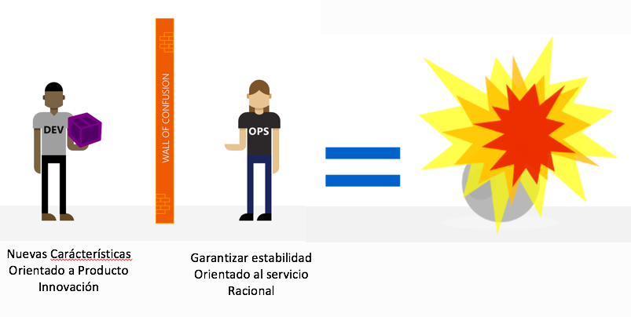

---

- Los contenedores también aíslan las aplicaciones entre sí en un sistema operativo compartido.
- Las aplicaciones en contenedor se ejecutan sobre un host de contenedor que a su vez se ejecuta en el sistema operativo (Linux o Windows). 
- Por lo tanto, los contenedores tienen una superficie significativamente menor que las imágenes de máquina virtual (VM).
---
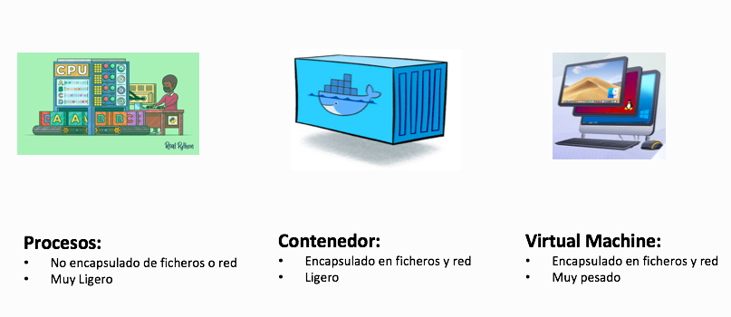

---
# Máquinas Virtuales
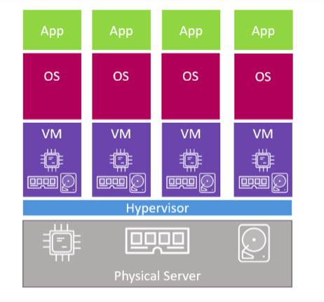

---

# Contenedores
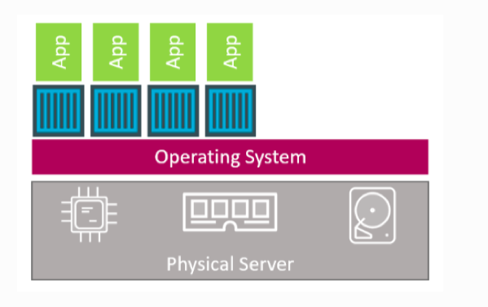

---
# Contenedores
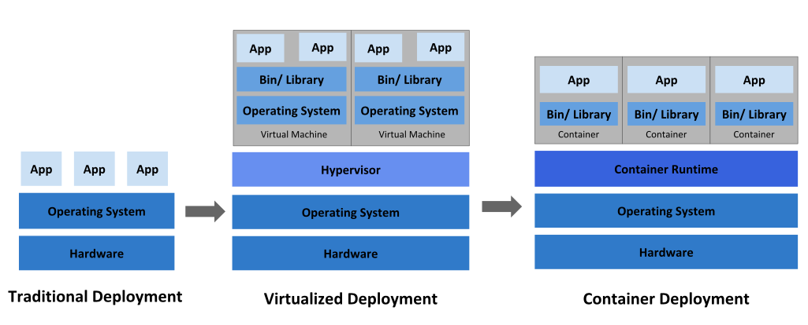

---

# 3. Docker
- Docker es un proyecto de código abierto para automatizar la implementación de aplicaciones como contenedores portátiles y autosuficientes, que se pueden ejecutar en la nube o localmente. 
- Los contenedores de Docker se pueden ejecutar en cualquier lugar, a nivel local en el centro de datos de cliente, en un proveedor de servicios externo o en la nube, en Azure. 
- Los contenedores de imagen de Docker se pueden ejecutar de forma nativa en Linux y Windows.
- Sin embargo, las imágenes de Windows solo pueden ejecutarse en hosts de Windows y las imágenes de Linux pueden ejecutarse en hosts de Linux y hosts de Windows (con una máquina virtual Linux de Hyper-V, hasta el momento); donde host significa un servidor o una máquina virtual.
---
 

# Imagen de contenedor
- Un paquete con todas las dependencias y la información necesarias para crear un contenedor. Una imagen incluye todas las dependencias y código de nuestra aplicación.
- Normalmente, una imagen se deriva de varias imágenes base que son capas que se apilan unas encima de otras para formar el sistema de archivos del contenedor.
- Una vez que se crea una imagen, esta es inmutable.

---

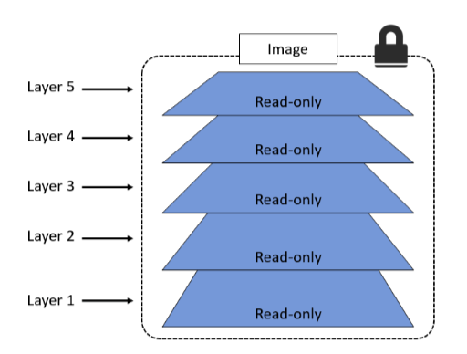

---

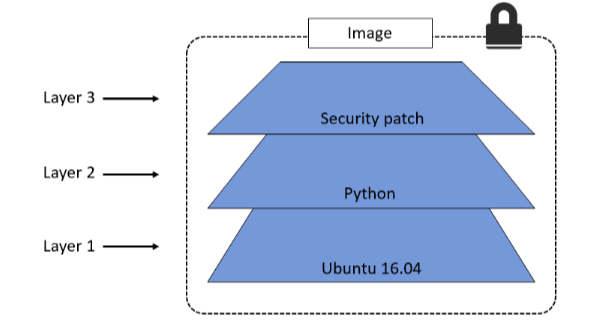

---

# Dockerfile
- Archivo de texto que contiene instrucciones sobre cómo compilar una imagen de Docker.
- Es como un script; la primera línea indica la imagen base con la que se comienza y, después, deben seguirse las instrucciones para instalar programas necesarios, copiar archivos, etc., hasta obtener el entorno de trabajo que se necesita.

---
# Build
- La acción de crear una imagen de contenedor basada en la información y el contexto que proporciona su Dockerfile, así como archivos adicionales en la carpeta en que se crea la imagen. 
- Las imagenes se compilan con el comando de Docker:
```bash
docker build .
```
---

# Contenedor
- Una instancia de una imagen de Docker. 
- Un contenedor representa la ejecución de una sola aplicación, proceso o servicio. 
- Está formado por el contenido de una imagen de Docker, un entorno de ejecución y un conjunto estándar de instrucciones. 
- Al escalar un servicio, crea varias instancias de un contenedor a partir de la misma imagen.
---

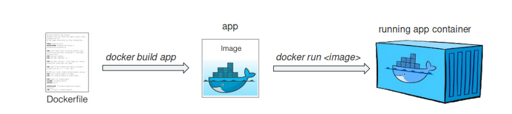


---

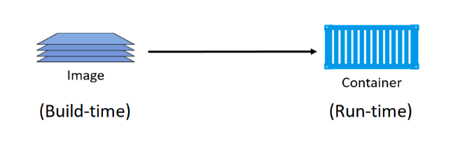

---

# Registro
- Los desarrolladores deben almacenar las imágenes en un registro, que actúa como una biblioteca de imágenes. - Docker mantiene un registro público a través de Docker Hub.
- Otros proveedores ofrecen registros para distintas colecciones de imágenes, como Amazon Elastic Container Registry (Amazon ECR). 
- Las empresas suelen tener registros privados para almacenar y administrar imágenes que han creado.


---

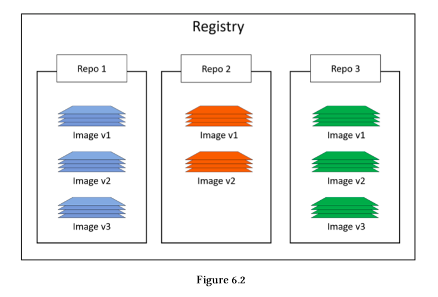

---


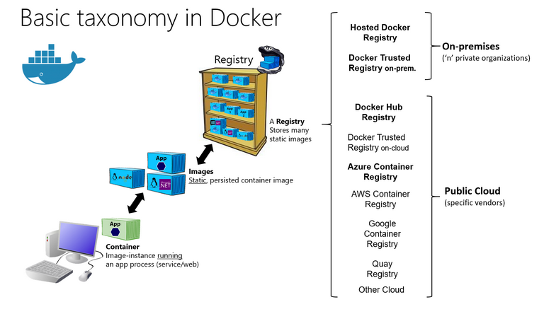


---

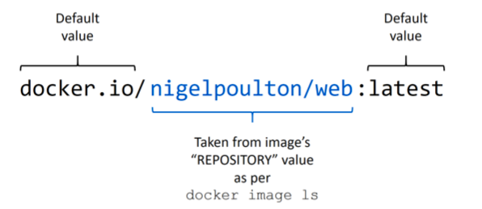

---

# Orquestador
- Herramienta que simplifica la administración de clústeres y hosts de Docker. 
- Puede administrar las redes de contenedor, las configuraciones, el equilibrio de carga, la detección de servicios, la alta disponibilidad, la configuración del host de Docker y muchas cosas más. 
- Un orquestador se encarga de ejecutar, distribuir, escalar y reparar las cargas de trabajo a través de una colección de nodos.
- El más conocido es Kubernetes, AWS nos proporciona tanto kuberntes como su propio servicio: Amazon Elasic Container Service. 


---

- Al usar Docker, un desarrollador crea una aplicación o un servicio y lo empaqueta, junto con sus dependencias, en una imagen de contenedor. Una imagen es una representación estática de la aplicación o el servicio y de su configuración y las dependencias.

---

- Para ejecutar la aplicación o el servicio, se crea una instancia de la imagen de la aplicación para crear un contenedor, que se ejecutará en el host de Docker.


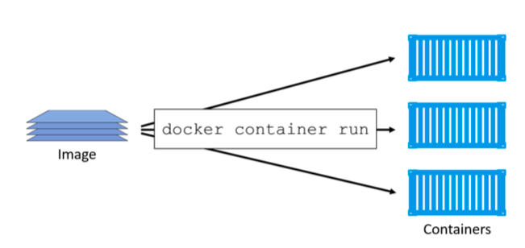


----
# 4. Proceso


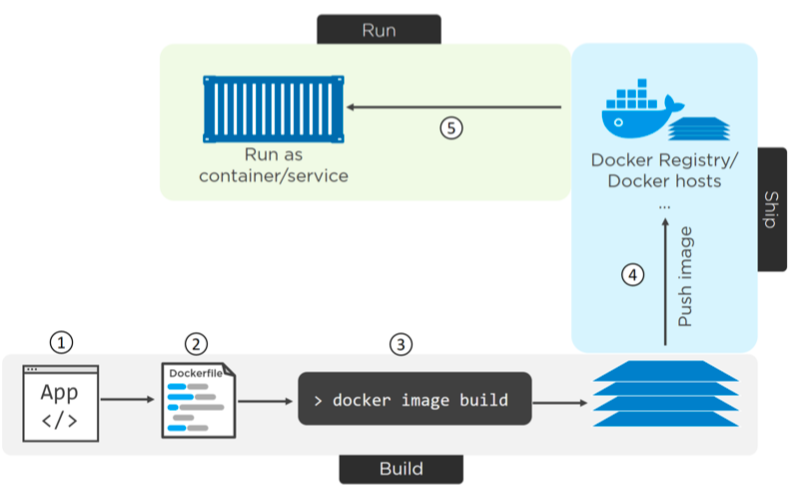

---

### 4.1. Creación del Dockerfile.
```dockerfile
# set base image (host OS)
FROM python:3.8

# set the working directory in the container
WORKDIR /code

# copy the dependencies file to the working directory
COPY requirements.txt .

# install dependencies
RUN pip install -r requirements.txt

# copy the content of the local src directory to the working directory
COPY src/ .

# command to run on container start
CMD [ "python", "./my_programa.py.py" ] 
```
---
Algunos comandos del dockerfile:
|Comando| Descripción|
|--|--|
|RUN| Ejecuta el comando cuando la imagen se está construyendo, típicamente usado para instalar software|
|CMD| Es el comando por defecto al inicializar el contenedor, puede ser sobrescrito por el usuario|
|COPY| Copia ficheros del host a la imagen|
|FROM| Indica la imagen base puede ser una propia o de dockerhub: https://hub.docker.com/_/python|
---

### 4.2. Construcción de las imagenes.
Para construir una imagen:
```bash
docker build -t <image-name> <path-to-dir>
```
- Este comando utiliza el dockerfile del directorio donde se usa.
- Este dockerfile tiene que llamarse: Dockerfile
- Ejemplo:
```bash
docker build -t my_image .
```
- Si queremos ponerle otro nombre al dockerfile usamos el comando:
```bash
docker build -t my_image -f dockerfilename .
```
---

Para ver las imágenes que tenemos en nuestro registro:
```bash
docker images
```
---

### 4.3. Ejecución de un contenedor.
Para ejecutar un contenedor a partir de una imagen:
```bash
docker run my_image
```
---

Podemos definir algunas opciones:

|Opción| Descripción|
|--|--|
|-i| interactivo|
|-t| obtener una terminal dentro del contendor|
|--rm| eliminar el contenedor una vez terminado|
|-d| Detach|
|-p 8080:80| mapear un puerto host-contenedor|
|-v /mydir:/targetdir ...| mapear un directório del host a dentro del contendor|


---
# Puertos


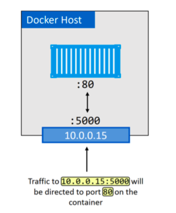

---
# Volumes

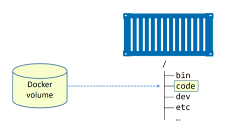


---

Por ejemplo el siguiente comando crea una terminal en un contenedor que usa la imagen python:
```bash
docker run -it python:3.8 bash
```

---
Algunos otros comandos de docker:

|Comando| Descripción|
|--|--|
|docker ps| muestra los contendores ejecutándose actualmente|
|docker ps -a| muestra todos los contenedores|
|docker stop <container-hash-or-name>| Para el contenedor|
|docker rm <container-hash-or-name>|| Elimina el contendor|
|docker rmi <image-name>| Elimina la imagen|


--- 

# DEMO

---
# Ejercicio
- Instala docker en tu equipo: https://www.docker.com/
- Usa el código de la carpeta ejemplo_docker_1.
- Construye la imagen.
- Ejecuta el contenedor.