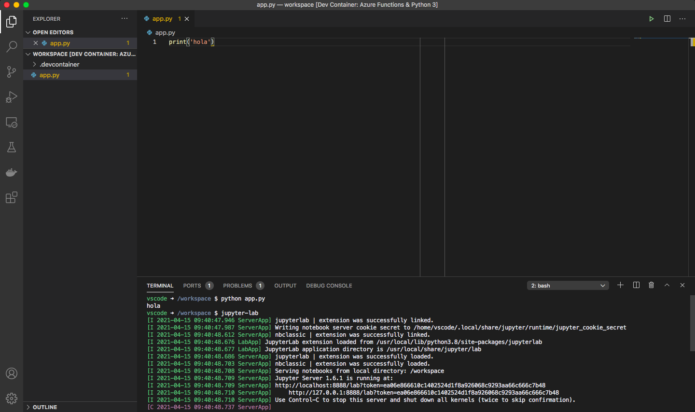

# Entorno de desarrollo con contenedores en vscode

---

- La extensión Visual Studio Code Remote - Containers permite usar un contenedor docker como entorno de desarrollo.
 

- Es parecido a la extensión Remote SSH.

---
# Ejemplo
- Un fichero con nombre: devcontainer.json en la carpeta .vscode permite la configuración de todo el entorno.
- Puedes ver un ejemplo en la carpeta ejemplo_dev_container.
---
# Ejemplo
- Abrir la carpeta en vscode.
- Instalar la extensión remote containers.
 

---

# Ejemplo
- Pulsar el boton verde: 

- Seleccionar la opción: open in remote container.

---

- Una vez construida la imagen el vscode estará integrdo dentro de nuestro contenedor de desarrollo.
