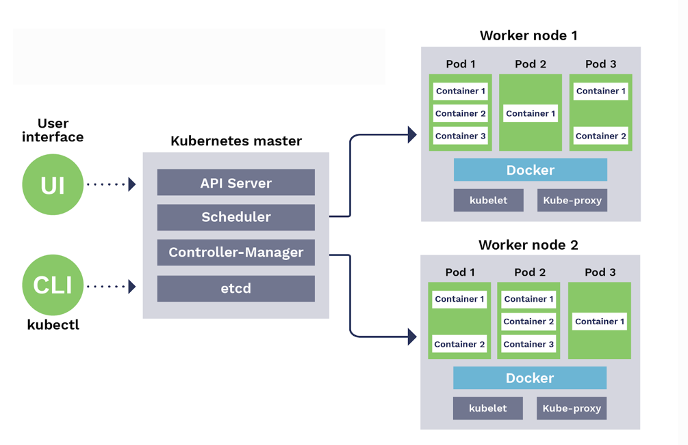
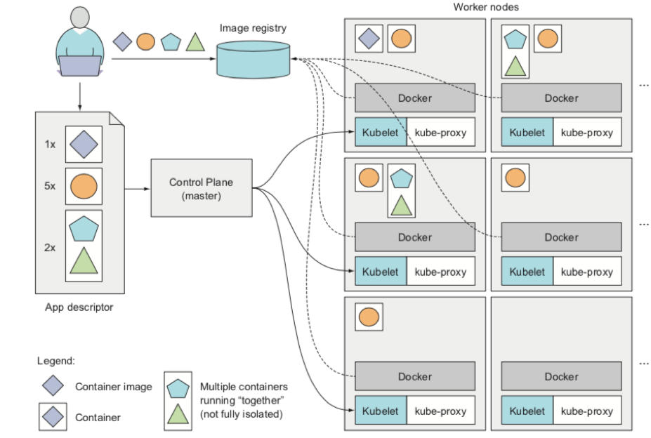
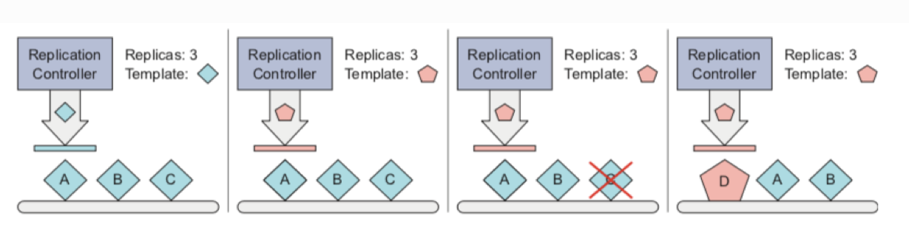

# Introducción a kubernetes

---

 

- Kubernetes es una plataforma portable y extensible de código abierto para administrar cargas de trabajo y servicios.
- Kubernetes facilita la automatización y la configuración declarativa. 
- Kubernetes ofrece un entorno de administración centrado en contenedores.

---

---

---
# Replicación

---

# DEMO

<!-- # Demo
- Podemos deplegar nuestra aplicación desde la intefaz web o desde la terminal.
- En kubernetes todo se define con ficheros YAML.
- Puedes ver un ejemplo en la carpeta kube_dash. -->
