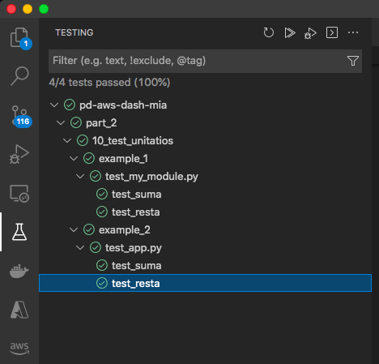
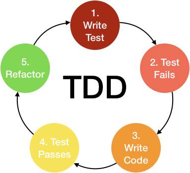

# Test unitarios con pytest.

<style>
img[alt~="center"] {
  display: block;
  margin: 0 auto;
}
</style>


---

- Cuando un código va a dar servicio durante mucho tiempo y es posible que tengamos que hacer cambios en el mismo, es muy importante tener test funionales y unitarios.
- Para ello usamos la heramienta pytest.
```bash
pip install pytest
```
- https://docs.pytest.org/en/6.2.x/

---

- **pytest** basicamente ejecuta todas las funciones que empiecen por la palabra **test**, que esten dentro de ficheros que tambien empiecen por **test**.
- Los test pasaran si ninguna de las funciones falla al ejecutarse.
- Para eso solemos usar la operación **assert**:
```python
def test_resta():
    assert 2 == my_module.resta(4, 2)
    assert 0 == my_module.resta(2, 2)
```
- Existe muchas otras formas de hacer test con pytest: https://docs.pytest.org/en/6.2.x/assert.html#assert

---

##  Example 1
- En la carpeta **example_1** tenemos un ejemplo muy sencillo.
- En **my_module.py** esta el código a testear y en test_my_module.py los tests.
- Para ejecutar los test:
```bash
pytest
```

---

# DEMO


---

# vscode

- vscode detecta automaticamente los test.

- Nos permite tambien debugear los tests.

---

# DEMO

---

# Ejercicio.

- Prueba a ejecutar los tests de la carpeta **example_1**. Puedes hacerlo desde esa carpeta o copiar los ficheros en tu máquina EC2 y probarlo desde esta.
- Cambia el código de **my_module.py** y combrueba que sucede.
- Prueba a intentar ejecutarlos desde vscode.
- Añade un nuevo tests y ejecuta todos.
- Prueba a debugear un test desde vscode.

---

##  Example 2
- Podemos hacer test más complejos.
- En la carpeta **example_1** tenemos un ejemplo para testear un api.

---

# Test Driven Development



---

# Flake8

- Existe otra herramienta muy usada en devops para comprobar el pep8.
- Se instala con:
```bash
pip install flake8
```
- Ejecutamos con:
```bash
flake8 .
```

---

# Ejercicio
- Instala flake8 en el virtual enviroment.
- Prueba flake8 en la carpeta example_2.
- Soluciona los errores que salgan en la terminal.
