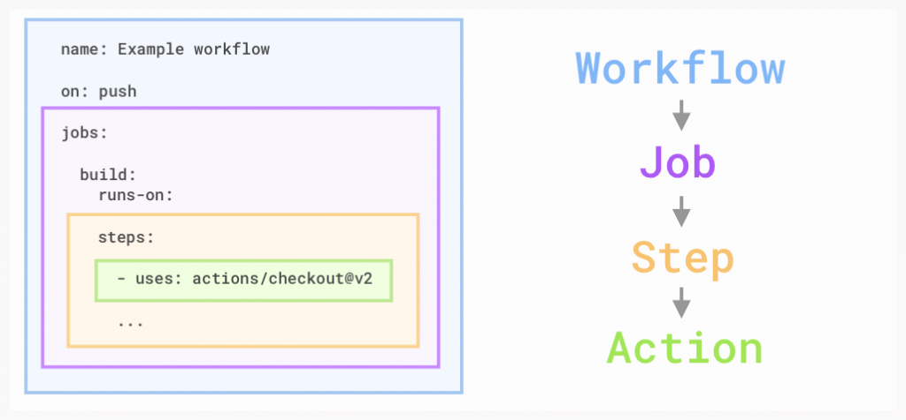

# Introducción a Github Actions.

<style>
img[alt~="center"] {
  display: block;
  margin: 0 auto;
}
</style>


---


- Las acciones de github nos dan la posibilidad de automatizar los distintos pasos de compilación y test de nuestros proyectos.


---


- Github Actions ha creado el concepto de workflow el cual es el encargado principal de todo nuestro proceso o Pipeline. 
- Se puede configurar de manera que Github reaccione a ciertos eventos (por ejemplo cuando se hace un nuevo push a una rama), automáticamente de forma periódica o por eventos externos.

- Especificando en dicho workflow que se analicen los componentes del proyecto, una vez terminados se mostrarán los resultados de los mismos y se podrá comprobar si el cambio en dicha rama ha producido algún error o ha ido todo bien. 

---

- Se ejecuta en un runner o instancia en un servidor.
-  Github te da la posibilidad de utilizar un runner hosteado por Github o añadir un host propio.


---




---

- Workflow: como ya hemos comentado anteriormente, es un procedimiento automatizado el cual se añade a un repositorio. Con él se puede hacer el build, test, package, release o deploy de un proyecto dentro de Github.
- Job: es un conjunto de steps que se ejecutan en runner de nuestro proceso.
- Step: es una tarea individual que puede ejecutar comandos dentro de un job. Un job está formado por uno o más steps y éstos están ejecutados sobre el mismo runner a la hora de ejecutarse el workflow.
- Action: Son los comandos de ejecución del proceso, ejecutados en un step para crear un job. Son el bloque de construcción más pequeño que hay. Puedes crear tus propios actions o utilizar algunos de ellos que ya están creados por la comunidad de Github. Obligatoriamente para utilizar un action en un workflow, éste debe ir incluido en un step.

---


- Primero tenemos que crear una carpeta en la que añadiremos el fichero de configuración del workflow. 
- Esta carpeta tiene por norma que llamarse .github/workflows/ . 
- En esa carpeta vamos a tener todos nuestros workflows.
- Github Actions utiliza la sintaxis de YAML para especificar la configuración de todo el workflow: https://en.wikipedia.org/wiki/YAML o https://yaml.org/spec/1.2.2/

---

# Ejemplo


```yaml
name: Run Python Tests and flake 8
on:
  push:
    branches:
      - main
  pull_request:
    branches:
      - main

jobs:
  build:
    runs-on: ubuntu-latest
    steps:
      - uses: actions/checkout@v2
      - name: Install Python 3
        uses: actions/setup-python@v1
        with:
          python-version: 3.6
      - name: Install dependencies
        run: |
          python -m pip install --upgrade pip
          pip install -r requirements.txt
      - name: Run flake8
        run: flake8 . 
      - name: Run tests with pytest
        run: pytest 
```

---

# DEMO

---

# Ejercicio

- Crea un nuevo repo.
- Genera el fichero requirements.txt con las librerias pytest y flake8.
- Crea una función con su tests.
- Genera un workflow de github con el ejemplo.
- Comprueba que se ejecuta cuando hacemos algún cambio. 


